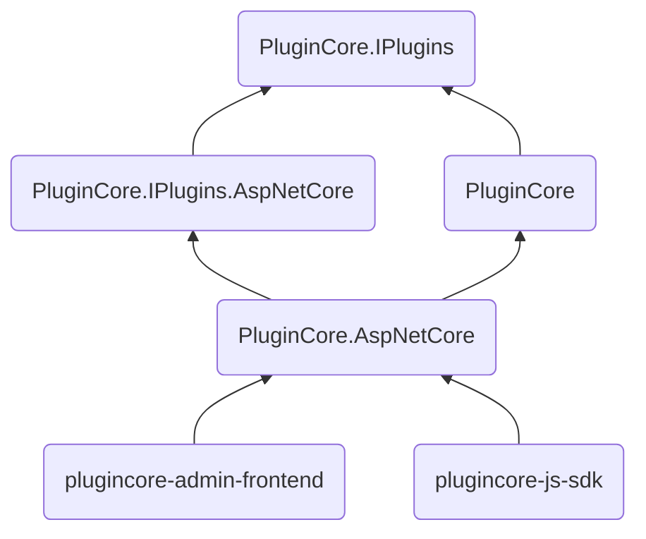

<p align="center">
  
</p>
<h1 align="center">PluginCore</h1>

English | [中文](README_zh.md)

> 🔌 `ASP.NET Core` lightweight plugin framework | ASP.NET Core 轻量级 插件框架 - 一分钟集成 | Vue.js frontend | JavaScript SDK

[]()
[](https://github.com/yiyungent/PluginCore/blob/main/LICENSE)
[](https://www.codefactor.io/repository/github/yiyungent/plugincore)
[](https://www.nuget.org/packages/PluginCore/)
[](https://jq.qq.com/?_wv=1027&k=q5R82fYN)
[](https://t.me/xx_dev_group)
<!--  -->
[](https://cla-assistant.io/yiyungent/PluginCore)
[](https://app.fossa.com/projects/git%2Bgithub.com%2Fyiyungent%2FPluginCore?ref=badge_shield)
[](https://deepwiki.com/yiyungent/PluginCore)

## Introduce

🔌 `ASP.NET Core` lightweight plugin framework | ASP.NET Core 轻量级 插件框架 - 一分钟集成 | Vue.js frontend | JavaScript SDK

- **Simple** - Agreement is better than configuration, with minimal configuration to help you focus on your business
- **Out of the box** - Automatic front-end and back-end integration, two lines of code complete the integration
- **Dynamic WebAPI** - Each plug-in can add a Controller and have its own routing
- **Plugin isolation and sharing** - Perfect plugin isolation and type sharing
- **Front and back ends of the plug-in are separated** - You can place the front-end files (index.html,...) under the plugin `wwwroot` folder, and then visit `/plugins/pluginId/index.html`
- **Hot swap** - Upload, install, enable, disable, uninstall, and delete without restarting the site; you can even add the `HTTP request pipeline middleware` at runtime through the plug-in, and there is no need to restart the site
- **Dependency injection** - You can apply for dependency injection in the construction method of the plug-in class that implements IPlugin. Of course, dependency injection can also be used in the controller construction method
- **Modular** - Process modularization, full dependency injection, can be implemented by replacement to customize the plug-in mechanism
- **Easy to expand** - You can write your own plug-in SDK, then reference the plug-in SDK, write extension plug-ins-custom plug-in hooks, and apply
- **Plugin dependency tree** - Declarative dependencies, automatically establish the correct loading order according to the dependencies between plugins
- **Life cycle** - Controllable plug-in life cycle, perfect event distribution
- **Widget** - You can bury extension points in the front end, inject widgets through plug-ins, widgets have perfect HTML/CSS/JavaScript support, and elegant event dispatch
- **No database required** - No database dependency
- **0 intrusion** - Nearly zero intrusion, does not affect your existing system
- **Little reliance** - Only rely on a third-party package (`SharpZipLib` for decompression)
- **Globalization** - Thanks to the internationalization implementation of `i18n`, it provides multi-language switching support


## Online demo

- [https://knifehub.onrender.com](https://knifehub.onrender.com)
  - Username: admin Password: ABC12345
  - Online demo, use [KnifeHub](https://github.com/yiyungent/KnifeHub), empty data from time to time
  - Not the latest version

## Tech Stack

- Backend: .NET/C#: .NET Standard & .NET Core & .NET & ASP.NET Core
- Frontend: Vue.js & vue-i18n & Vue Router & Vuex & Element UI
- Frontend: babel & mockjs & sass & autoprefixer & eslint & axios & npm

> Related Online Products:         
> - [https://120365.xyz](https://120365.xyz)          
>   - Online Tools Collection   
>   - Data Analysis Visualization    
>   - Time Management    
>   - Efficiency Toolbox    

## Screenshot


## One minute integration

Recommended Use [NuGet](https://www.nuget.org/packages/PluginCore), Execute the following commands in the root directory of your project. If you use Visual Studio, then click **Tools** -> **NuGet Package Manager** -> **Package Manager Console**, make sure "Default project" It is the item you want to install, enter the command below to install it.


### ASP.NET Core Project

```bash
PM> Install-Package PluginCore.AspNetCore
```

> Modify the code in your ASP.NET Core application
>
> Startup.cs

```C#
using PluginCore.AspNetCore.Extensions;

// This method gets called by the runtime. Use this method to add services to the container.
public void ConfigureServices(IServiceCollection services)
{
    services.AddControllers();

    // 1. Add PluginCore
    services.AddPluginCore();
}

// This method gets called by the runtime. Use this method to configure the HTTP request pipeline.
public void Configure(IApplicationBuilder app, IWebHostEnvironment env)
{
    if (env.IsDevelopment())
    {
        app.UseDeveloperExceptionPage();
    }

    app.UseHttpsRedirection();

    app.UseRouting();

    // 2. Use PluginCore
    app.UsePluginCore();

    app.UseAuthorization();

    app.UseEndpoints(endpoints =>
    {
        endpoints.MapControllers();
    });
}
```

> Now visit https://localhost:5001/PluginCore/Admin to enter PluginCore Admin
> https://localhost:5001 Need to be changed to your address

### Notice

Please log in to `PluginCore Admin`, and for safety, modify the default user name and password in time:

`App_Data/PluginCore.Config.json`     

```json
{
	"Admin": {
		"UserName": "admin",
		"Password": "ABC12345"
	},
	"FrontendMode": "LocalEmbedded",
	"RemoteFrontend": "https://cdn.jsdelivr.net/gh/yiyungent/plugincore-admin-frontend@0.1.2/dist-cdn"
}
```

After the modification, it will take effect immediately, no need to restart the site, you need to log in to `PluginCore Admin` again


## Docker experience

If you need to experience PluginCore locally, then here is an [example(/examples)](https://github.com/yiyungent/PluginCore/tree/main/examples)

```bash
docker run -d -p 5004:80 -e ASPNETCORE_URLS="http://*:80" --name plugincore-aspnetcore3-1 yiyungent/plugincore-aspnetcore3-1
```

Now you can visit http://localhost:5004/PluginCore/Admin

> add:     
> If you use `Docker Compose`, you can refer to `docker-compose.yml` in the root directory of the warehouse

> add:   
> Use `ghcr.io`     
> 
> ```bash
> docker run -d -p 5004:80 -e ASPNETCORE_URLS="http://*:80" --name plugincore-aspnetcore3-1 ghcr.io/yiyungent/plugincore-aspnetcore3-1
> ```

## Use

- [Detailed Documentation(/docs)](https://yiyungent.github.io/PluginCore "Online Documentation") Document is under construction
- [API Docs](https://yiyungent.github.io/PluginCore/docs-api/api/index.html "API Docs") automatic update
- [See examples(/examples)](https://github.com/yiyungent/PluginCore/tree/main/examples) 


### Add plugin hook and apply

> 1. For example, custom plug-in hook: `ITestPlugin`

```C#
using PluginCore.IPlugins;

namespace PluginCore.IPlugins
{
    public interface ITestPlugin : IPlugin
    {
        string Say();
    }
}
```

> 2. Apply the hook where it needs to be activated, so that all enabled plug-ins that implement `ITestPlugin` will call `Say()`

```C#
using PluginCore;
using PluginCore.IPlugins;

namespace WebApi.Controllers
{
    [Route("api/[controller]")]
    [ApiController]
    public class TestController : ControllerBase
    {
        private readonly PluginFinder _pluginFinder;

        public TestController(PluginFinder pluginFinder)
        {
            _pluginFinder = pluginFinder;
        }

        public ActionResult Get()
        {
            //var plugins = PluginFinder.EnablePlugins<BasePlugin>().ToList();
            // All enabled plugins that implement ITestPlugin
            var plugins2 = _pluginFinder.EnablePlugins<ITestPlugin>().ToList();

            foreach (var item in plugins2)
            {
                // transfer
                string words = item.Say();
                Console.WriteLine(words);
            }

            return Ok("");
        }
    }
}
```

### Custom frontend

PluginCore supports 3 front-end file loading methods

> `FrontendMode` in the configuration file `App_Data/PluginCore.Config.json`

1. LocalEmbedded
  - By default, embedded resources and front-end files are packaged into dll. In this mode, it is not easy to customize the front-end files. You need to modify the source code of `PluginCore` and recompile. It is not recommended

2. LocalFolder
  - In the ASP.NET Core project that integrates `PluginCore`, create a new `PluginCoreAdmin`, and put the front-end files into this folder

3. RemoteCDN
  - To use remote CDN resources, you can specify the url through the `RemoteFrontend` in the configuration file

> **Note:**    
> After updating `FrontendMode`, the site needs to be restarted for the changes to take effect


### Additional Information

> **Additional Information**
>
> To develop plugins, you only need to add a reference to the `PluginCore.IPlugins` package (plugin SDK),        
>
> Of course, if you need `PluginCore`, you can also add a reference


> **Specifications**
>
> 1. Plugin SDK
>
> Plugin interfaces should be located in the `PluginCore.IPlugins` namespace. This is a convention, not mandatory, but it is recommended to do so,      
>
> The assembly name does not have to be the same as the namespace name. You can completely use the `PluginCore.IPlugins` namespace in your plugin SDK assembly.
>
> 2. Plugin
>
> The plugin assembly name (usually = project name) must match the `PluginId` in the plugin `info.json`, for example: Project: `HelloWorldPlugin`, PluginId: `HelloWorldPlugin`. This is required, otherwise the plugin cannot be loaded
> `PluginId` is the unique identifier of the plugin


## Version dependency

> Since `PluginCore.IPlugins-v0.8.0`, the `PluginCore` project has been refactored. `PluginCore` only contains core plugin logic, and `ASP.NET Core` needs to use `PluginCore.AspNetCore`

|      PluginCore.IPlugins       |     0.8.0     |     0.8.0     |     0.8.0     |     0.8.0     |     0.8.0     |     0.8.0     |     0.8.0     |     0.8.0     |     0.8.0     |     0.8.0     |     0.8.0     |     0.8.0     |     0.9.0     |     0.9.0     |     0.9.0     |     0.9.0     |     0.9.1     |     0.9.1     |     0.9.1     |
| :----------------------------: | :-----------: | :-----------: | :-----------: | :-----------: | :-----------: | :-----------: | :-----------: | :-----------: | :-----------: | :-----------: | :-----------: | :-----------: | :-----------: | :-----------: | :-----------: | :-----------: | :-----------: | :-----------: | :-----------: |
|           PluginCore           |     1.0.0     |     1.0.0     |     1.0.0     |     1.0.0     |     2.0.0     |     2.0.0     |     2.0.1     |     2.0.1     |     2.0.1     |     2.0.2     |     2.0.2     |     2.1.0     |     2.2.0     |     2.2.1     |     2.2.2     |     2.2.2     |     2.2.3     |     2.2.3     |     2.2.4     |
| PluginCore.IPlugins.AspNetCore |     0.0.1     |     0.0.1     |     0.0.1     |     0.0.1     |     0.0.1     |     0.0.1     |     0.0.1     |     0.0.1     |     0.0.1     |     0.0.1     |     0.0.1     |     0.0.1     |     0.1.0     |     0.1.0     |     0.1.0     |     0.1.0     |     0.1.1     |     0.1.1     |     0.1.1     |
|     PluginCore.AspNetCore      |     0.0.2     |     0.0.3     |     0.0.4     |     0.0.5     |     0.0.5     |     1.0.0     |     1.0.1     |     1.0.2     |     1.0.3     |     1.0.4     |     1.1.0     |     1.2.0     |     1.3.1     |     1.3.2     |     1.3.2     |     1.3.3     |     1.3.4     |     1.4.0     |     1.4.1     |
|   plugincore-admin-frontend    | 0.1.0 - 0.3.1 | 0.1.0 - 0.3.1 | 0.1.0 - 0.3.1 | 0.1.0 - 0.3.1 | 0.1.0 - 0.3.1 | 0.1.0 - 0.3.1 | 0.1.0 - 0.3.1 |     0.3.2     |     0.3.2     |     0.3.2     |     0.3.2     |     0.3.2     |     0.3.2     |     0.3.2     |     0.3.2     |     0.3.2     |     0.3.2     |     0.3.2     |     0.3.2     |
|       plugincore-js-sdk        | 0.1.0 - 0.5.0 | 0.1.0 - 0.5.0 | 0.1.0 - 0.5.0 | 0.1.0 - 0.5.0 | 0.1.0 - 0.5.0 | 0.1.0 - 0.5.0 | 0.1.0 - 0.5.0 | 0.1.0 - 0.5.0 | 0.1.0 - 0.5.0 | 0.1.0 - 0.5.0 | 0.1.0 - 0.5.0 | 0.1.0 - 0.5.0 | 0.1.0 - 0.5.0 | 0.1.0 - 0.5.0 | 0.1.0 - 0.5.0 | 0.1.0 - 0.5.0 | 0.1.0 - 0.5.0 | 0.1.0 - 0.5.0 | 0.1.0 - 0.5.0 |

> Below are the old version dependencies, for archival purposes only

|    PluginCore.IPlugins    | 0.1.0 | 0.1.0 | 0.2.0 | 0.2.0 | 0.2.0 | 0.3.0 | 0.3.0 | 0.4.0 | 0.5.0 | 0.6.0 | 0.6.0 | 0.6.0 | 0.6.0 | 0.6.1 | 0.6.1 | 0.6.1 | 0.7.0 | 0.7.0 | 0.7.0 | 0.7.0 |
| :-----------------------: | :---: | :---: | :---: | :---: | :---: | :---: | :---: | :---: | :---: | :---: | :---: | :---: | :---: | :---: | :---: | :---: | :---: | :---: | :---: | :---: |
|        PluginCore         | 0.1.0 | 0.2.0 | 0.3.0 | 0.3.1 | 0.4.0 | 0.5.0 | 0.5.1 | 0.6.0 | 0.7.0 | 0.8.0 | 0.8.1 | 0.8.2 | 0.8.3 | 0.8.4 | 0.8.5 | 0.8.6 | 0.9.0 | 0.9.1 | 0.9.2 | 0.9.3 |
| plugincore-admin-frontend | 0.1.0 | 0.1.2 | 0.1.2 | 0.1.3 | 0.1.3 | 0.2.0 | 0.2.0 | 0.2.0 | 0.2.0 | 0.2.0 | 0.2.3 | 0.2.3 | 0.2.3 | 0.2.3 | 0.3.0 | 0.3.0 | 0.3.0 | 0.3.0 | 0.3.0 | 0.3.1 |
|     plugincore-js-sdk     |   -   |   -   |   -   |   -   |   -   |   -   |   -   |   -   |   -   |   -   |   -   |   -   |   -   |   -   |   -   |   -   | 0.1.0 | 0.1.0 | 0.1.0 | 0.1.0 |


|      PluginCore.IPlugins       | [](https://www.nuget.org/packages/PluginCore.IPlugins/) | [](https://www.nuget.org/packages/PluginCore.IPlugins/) |
| :----------------------------: | :----------------------------------------------------------: | :----------------------------------------------------------: |
|           PluginCore           | [](https://www.nuget.org/packages/PluginCore/) | [](https://www.nuget.org/packages/PluginCore/) |
| PluginCore.IPlugins.AspNetCore | [](https://www.nuget.org/packages/PluginCore.IPlugins.AspNetCore/) | [](https://www.nuget.org/packages/PluginCore.IPlugins.AspNetCore/) |
|     PluginCore.AspNetCore      | [](https://www.nuget.org/packages/PluginCore.AspNetCore/) | [](https://www.nuget.org/packages/PluginCore.AspNetCore/) |
|      PluginCore.Template       | [](https://www.nuget.org/packages/PluginCore.Template/) | [](https://www.nuget.org/packages/PluginCore.Template/) |
|      plugincore-admin-frontend       | [](https://www.npmjs.com/package/plugincore-admin-frontend) | [](https://www.npmjs.com/package/plugincore-admin-frontend) |
|      plugincore-js-sdk       | [](https://www.npmjs.com/package/@yiyungent/plugincore) | [](https://www.npmjs.com/package/@yiyungent/plugincore) |


## Project structure



## Environment

- Runtime: .NET Core 3.1 (+)
- Development: Visual Studio Community 2019

## Related Projects

### Components of This Project

- [yiyungent/PluginCore/plugincore-admin-frontend](https://github.com/yiyungent/PluginCore/tree/main/plugincore-admin-frontend) - PluginCore Admin Frontend Implementation
- [yiyungent/PluginCore/plugincore-js-sdk](https://github.com/yiyungent/PluginCore/tree/main/plugincore-js-sdk) - Frontend Widget Dependencies

### Predecessors/Related Projects

- [yiyungent/Remember.Core](https://github.com/yiyungent/Remember.Core) - 🐬 .NET Web Application Framework. remember for ASP.NET Core
- [yiyungent/PluginHub](http://github.com/yiyungent/PluginHub) - 🍰 ASP.NET MVC Plugin Solution
- [yiyungent/Templates](https://github.com/yiyungent/Templates) - 🎨 ASP.NET MVC5 Multi-Theme Template Solution

### Projects Using This Project

- [yiyungent/KnifeHub](https://github.com/yiyungent/KnifeHub) - 【PluginCore.AspNetCore Best Practice】Tool Platform | Daily Life/Learning/Work/Development Tool Collection
- [yiyungent/Dragonfly](https://github.com/yiyungent/Dragonfly) - ASP.NET Core + Selenium Web Automation Implementation


## Acknowledgments

- Plugin system design referenced from <a href="https://github.com/lamondlu/CoolCat" target="_blank">CoolCat</a>, thanks to author lamondlu for the contribution
- Design referenced from <a href="https://github.com/nopSolutions/nopCommerce" target="_blank">nopCommerce</a>, thanks to author nopSolutions for the contribution


### Special Thanks

<!-- 本项目已加入 ZMTO & JetBrains & Netlify 开源项目计划 -->
This project has joined the zmto & JetBrains & Netlify Open Source Program.

<!-- https://zmto.com/opensource -->
<!-- https://www.jetbrains.com/shop/eform/opensource -->
<!-- https://www.netlify.com/legal/open-source-policy/ -->

<!-- > [ReSharper](https://www.jetbrains.com/resharper/?from=PluginCore) 是一个强大的 Visual Studio 扩展，适用于 .NET 平台语言。 -->

Special thanks to [ZMTO](https://zmto.com/) for sponsoring servers for this project for testing purposes.

Special thanks to [JetBrains](https://www.jetbrains.com/?from=KnifeHub) for providing free licenses of [ReSharper](https://www.jetbrains.com/resharper/?from=KnifeHub) and more for open-source projects.  
[](https://www.jetbrains.com/?from=KnifeHub)

Special thanks to [Netlify](https://www.netlify.com) for supporting open-source projects.  
[](https://www.netlify.com)


## Sponsors

This list is automatically updated by [afdian-action](https://github.com/yiyungent/afdian-action)

Thanks to these sponsors from Afdian:

<!-- AFDIAN-ACTION:START -->

<a href="https://afdian.net/u/e98feb9e12d511efa7b352540025c377">
    
</a>
<a href="https://afdian.net/u/1ec1819cde6c11ec95b252540025c377">
    
</a>
<a href="https://afdian.net/u/98e9914c457911ee95eb52540025c377">
    
</a>
<a href="https://afdian.net/u/c4a50eea706211ebb48352540025c377">
    
</a>
<a href="https://afdian.net/u/459023b8e07b11eb92af52540025c377">
    
</a>
<a href="https://afdian.net/u/6c944aa0a55f11eabd5f52540025c377">
    
</a>

<details>
  <summary>Click to open/close sponsor list</summary>

<a href="https://afdian.net/u/e98feb9e12d511efa7b352540025c377">
爱发电用户_e98fe
</a>
<span>( 1 次赞助, 共 ￥30 ) 留言: </span><br>
<a href="https://afdian.net/u/1ec1819cde6c11ec95b252540025c377">
RemMai
</a>
<span>( 1 次赞助, 共 ￥15 ) 留言: 感谢提供插件灵感。
...</span><br>
<a href="https://afdian.net/u/98e9914c457911ee95eb52540025c377">
浮沉
</a>
<span>( 1 次赞助, 共 ￥100 ) 留言: </span><br>
<a href="https://afdian.net/u/c4a50eea706211ebb48352540025c377">
WiMi
</a>
<span>( 1 次赞助, 共 ￥30 ) 留言: 感谢分享</span><br>
<a href="https://afdian.net/u/459023b8e07b11eb92af52540025c377">
Dr
</a>
<span>( 1 次赞助, 共 ￥10 ) 留言: 非常感谢</span><br>
<a href="https://afdian.net/u/6c944aa0a55f11eabd5f52540025c377">
MonoLogueChi
</a>
<span>( 1 次赞助, 共 ￥28.2 ) 留言: 感谢你的开源项目</span><br>

</details>
<!-- 注意: 尽量将标签前靠,否则经测试可能被 GitHub 解析为代码块 -->
<!-- AFDIAN-ACTION:END -->


## Donate

PluginCore is an GNU LGPLv3 licensed open source project and completely free to use. However, the amount of effort needed to maintain and develop new features for the project is not sustainable without proper financial backing.

We accept donations through these channels:

- <a href="https://afdian.com/@yiyun" target="_blank">爱发电</a> (￥5.00 起)

## License
[](https://app.fossa.com/projects/git%2Bgithub.com%2Fyiyungent%2FPluginCore?ref=badge_large)

## Author

**PluginCore** © [yiyun](https://github.com/yiyungent), Released under the [GNU LGPLv3](./LICENSE) License.<br>
Authored and maintained by yiyun with help from contributors ([list](https://github.com/yiyungent/PluginCore/contributors)).

> GitHub [@yiyungent](https://github.com/yiyungent) Gitee [@yiyungent](https://gitee.com/yiyungent)

<!-- Matomo Image Tracker-->

<!-- End Matomo -->


