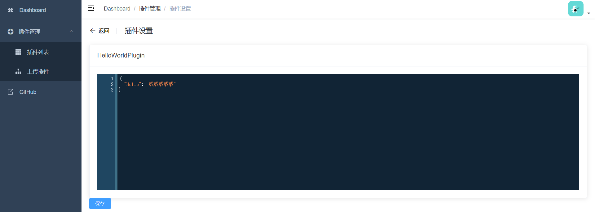
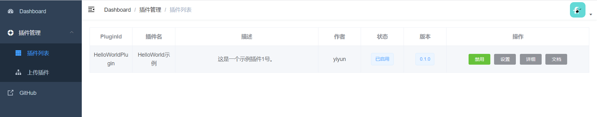
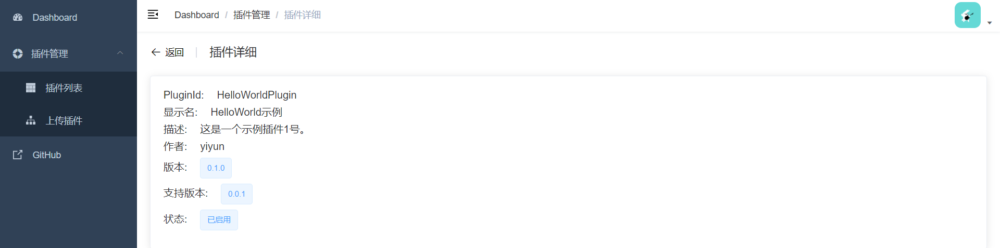
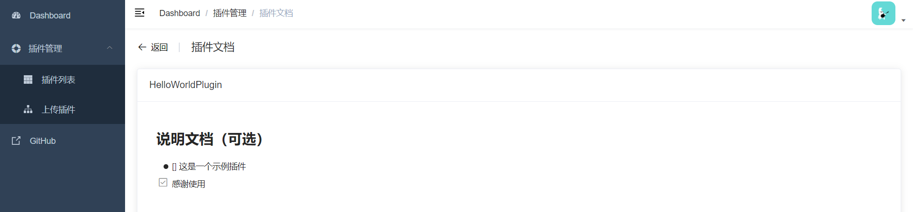

<p align="center">
  
</p>
<h1 align="center">PluginCore</h1>

> 适用于 ASP.NET Core 的轻量级插件框架

[]()
[](https://github.com/yiyungent/PluginCore/blob/master/LICENSE)


## 介绍

适用于 ASP.NET Core 的轻量级插件框架

- **简单** - 约定优于配置, 以最少的配置帮助你专注于业务
- **开箱即用** - 前后端自动集成
- **动态 WebAPI** - 每个插件都可新增 Controller, 拥有自己的路由
- **插件前后端分离** - 可在插件 `wwwroot` 文件夹下放置前端文件 (index.html,...), 然后访问 `/plugins/plugindId/index.html`
- **热插拔** - 上传、安装、启用、禁用、卸载 均无需重启站点
- **依赖注入** - 可在 实现 `IPlugin` 的插件类的构造方法上申请依赖注入项, 当然 `Controller` 构造方法上也可依赖注入
- **易扩展** - 你可以编写你自己的插件sdk, 然后引用插件sdk, 编写扩展插件 - 自定义插件钩子, 并应用
- **无需数据库** - 无数据库依赖
- **0侵入** - 近乎0侵入


## 截图










## 一分钟集成

推荐使用 [NuGet](https://www.nuget.org/packages/PluginCore), 在你项目的根目录 执行下方的命令, 如果你使用 Visual Studio, 这时依次点击 **Tools** -> **NuGet Package Manager** -> **Package Manager Console** , 确保 "Default project" 是你想要安装的项目, 输入下方的命令进行安装.

```bash
PM> Install-Package PluginCore
```

> 在你的 ASP.NET Core 应用程序中修改代码
>
> Startup.cs

```C#
using PluginCore.Extensions;

// This method gets called by the runtime. Use this method to add services to the container.
public void ConfigureServices(IServiceCollection services)
{
    services.AddControllers();

    // 1. 添加 PluginCore
    services.AddPluginCore();
}

// This method gets called by the runtime. Use this method to configure the HTTP request pipeline.
public void Configure(IApplicationBuilder app, IWebHostEnvironment env)
{
    if (env.IsDevelopment())
    {
        app.UseDeveloperExceptionPage();
    }

    app.UseHttpsRedirection();

    app.UseRouting();

    // 2. 使用 PluginCore
    app.UsePluginCore();

    app.UseAuthorization();

    app.UseEndpoints(endpoints =>
    {
        endpoints.MapControllers();
    });
}
```

> 现在访问 https://localhost:5001/PluginCore/Admin 即可进入 PluginCore Admin  
> https://localhost:5001 需改为你的地址

### 补充

请登录 `PluginCore Admin` 后，为了安全，及时修改默认用户名，密码:

`App_Data/PluginCore.Config.json`     

```json
{
    "Admin": {
        "UserName": "admin",
        "Password": "ABC12345"
    },
    "IsLocalFrontend": false,
    "RemoteFrontend": "https://cdn.jsdelivr.net/gh/yiyungent/plugincore-admin-frontend@0.1.2/dist-cdn"
}
```

修改后，立即生效，无需重启站点，需重新登录 `PluginCore Admin`


## Docker 体验

如果你需要在本地体验 PluginCore, 那么这里有一个 [例子/examples](https://github.com/yiyungent/PluginCore/tree/main/examples)

```bash
docker run -d -p 5004:80 -e ASPNETCORE_URLS="http://*:80" --name plugincore-aspnetcore3-1 yiyungent/plugincore-aspnetcore3-1
```

现在你可以访问 http://localhost:5004/PluginCore/Admin

> 补充:
> 使用 `ghcr.io`
> 
> ```bash
> docker run -d -p 5004:80 -e ASPNETCORE_URLS="http://*:80" --name plugincore-aspnetcore3-1 ghcr.io/yiyungent/plugincore-aspnetcore3-1
> ```

## 使用

<!-- - [详细文档(/docs)](https://moeci.com/PluginCore "在线文档") 文档构建中 -->
- [见示例(/examples)](https://github.com/yiyungent/PluginCore/tree/main/examples)


### 添加插件钩子, 并应用

> 1.例如，自定义插件钩子: `ITestPlugin`

```C#
using PluginCore.IPlugins;

namespace PluginCore.IPlugins
{
    public interface ITestPlugin : IPlugin
    {
        string Say();
    }
}
```

> 2.在需要激活的地方，应用钩子，这样所有启用的插件中，实现了 `ITestPlugin` 的插件，都将调用 `Say()`

```C#
using PluginCore;
using PluginCore.IPlugins;

namespace WebApi.Controllers
{
    [Route("api/[controller]")]
    [ApiController]
    public class TestController : ControllerBase
    {
        private readonly PluginFinder _pluginFinder;

        public TestController(PluginFinder pluginFinder)
        {
            _pluginFinder = pluginFinder;
        }

        public ActionResult Get()
        {
            //var plugins = PluginFinder.EnablePlugins<BasePlugin>().ToList();
            // 所有实现了 ITestPlugin 的已启用插件
            var plugins2 = _pluginFinder.EnablePlugins<ITestPlugin>().ToList();

            foreach (var item in plugins2)
            {
                // 调用
                string words = item.Say();
                Console.WriteLine(words);
            }

            return Ok("");
        }
    }
}
```


## 版本依赖

|    PluginCore.IPlugins    | 0.1.0 | 0.1.0 | 0.2.0 | 0.2.0 |
| :-----------------------: | :---: | :---: | :---: | :---: |
|        PluginCore         | 0.1.0 | 0.2.0 | 0.3.0 | 0.3.1 |
| plugincore-admin-frontend | 0.1.0 | 0.1.2 | 0.1.2 | 0.1.3 |


| PluginCore.IPlugins | [](https://www.nuget.org/packages/PluginCore.IPlugins/) | [](https://www.nuget.org/packages/PluginCore.IPlugins/) |
| :-----------------: | :----------------------------------------------------------: | :----------------------------------------------------------: |
|     PluginCore      | [](https://www.nuget.org/packages/PluginCore/) | [](https://www.nuget.org/packages/PluginCore/) |


> **补充**
>
> 开发插件只需要, 添加对 `PluginCore.IPlugins` 包 (插件sdk) 的引用即可，        
>
> 当然如果你需要 `PluginCore` ,  也可以添加引用


> **规范**
>
> 1. 插件sdk
> 
> 插件接口应当位于 `PluginCore.IPlugins` 命名空间，这是规范，不强求，但建议这么做，      
>
> 程序集名不一定要与命名空间名相同，你完全在你的插件sdk程序集中，使用 `PluginCore.IPlugins` 命名空间。
> 
> 2. 插件
> 
> 插件程序集名(一般=项目(Project)名) 与 插件 `info.json` 中 `PluginId` 一致, 例如: Project: `HelloWorldPlugin`, PluginId: `HelloWorldPlugin`
> `PluginId` 为插件唯一标识


## 环境

- 运行环境: .NET Core 3.1 (+)
- 开发环境: Visual Studio Community 2019

## 相关项目

- [plugincore-admin-frontend](https://github.com/yiyungent/plugincore-admin-frontend)

## 鸣谢


## Donate

PluginCore is an Apache-2.0 licensed open source project and completely free to use. However, the amount of effort needed to maintain and develop new features for the project is not sustainable without proper financial backing.

We accept donations through these channels:

- <a href="https://afdian.net/@yiyun" target="_blank">爱发电</a>

## Author

**PluginCore** © [yiyun](https://github.com/yiyungent), Released under the [Apache-2.0](./LICENSE) License.<br>
Authored and maintained by yiyun with help from contributors ([list](https://github.com/yiyungent/PluginCore/contributors)).

> GitHub [@yiyungent](https://github.com/yiyungent) Gitee [@yiyungent](https://gitee.com/yiyungent)
