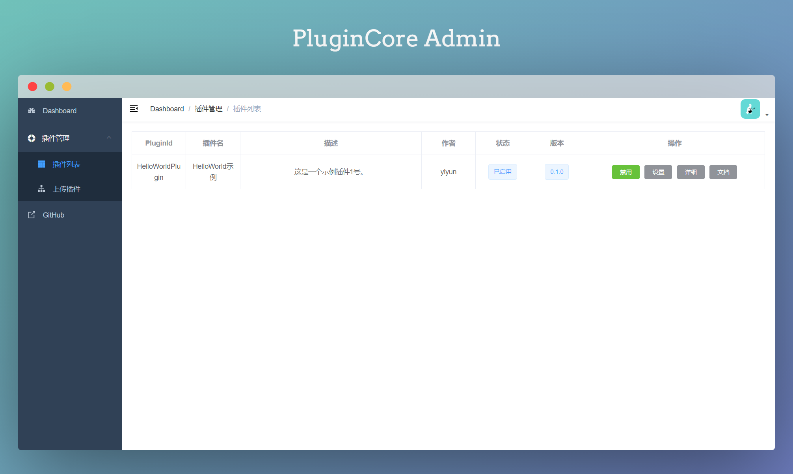
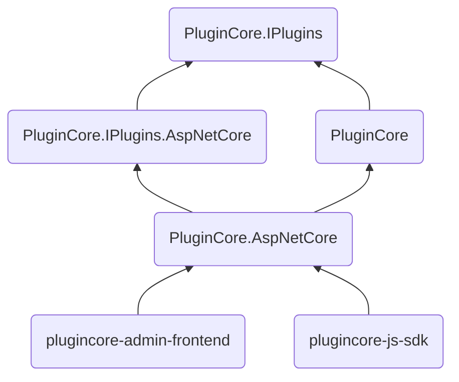

<p align="center">
  
</p>
<h1 align="center">PluginCore</h1>

English | [中文](README_zh.md)

> ASP.NET Core lightweight plugin framework

[]()
[](https://github.com/yiyungent/PluginCore/blob/main/LICENSE)
[](https://www.codefactor.io/repository/github/yiyungent/plugincore)
[](https://www.nuget.org/packages/PluginCore/)
[](https://jq.qq.com/?_wv=1027&k=q5R82fYN)
[](https://t.me/xx_dev_group)
<!--  -->
[](https://cla-assistant.io/yiyungent/PluginCore)


## Introduce

ASP.NET Core lightweight plugin framework

- **Simple** - Agreement is better than configuration, with minimal configuration to help you focus on your business
- **Out of the box** - Automatic front-end and back-end integration, two lines of code complete the integration
- **Dynamic WebAPI** - Each plug-in can add a Controller and have its own routing
- **Front and back ends of the plug-in are separated** - You can place the front-end files (index.html,...) under the plugin `wwwroot` folder, and then visit `/plugins/pluginId/index.html`
- **Hot swap** - Upload, install, enable, disable, uninstall, and delete without restarting the site; you can even add the `HTTP request pipeline middleware` at runtime through the plug-in, and there is no need to restart the site
- **Dependency injection** - You can apply for dependency injection in the construction method of the plug-in class that implements IPlugin. Of course, dependency injection can also be used in the controller construction method
- **Modular** - Process modularization, full dependency injection, can be implemented by replacement to customize the plug-in mechanism
- **Easy to expand** - You can write your own plug-in SDK, then reference the plug-in SDK, write extension plug-ins-custom plug-in hooks, and apply
- **Widget** - You can bury the extension point in the front end, and then insert the widget through the plugin
- **No database required** - No database dependency
- **0 intrusion** - Nearly zero intrusion, does not affect your existing system
- **Little reliance** - Only rely on a third-party package (`SharpZipLib` for decompression)


## Online demo

- http://plugincore.moeci.com/PluginCore/Admin
  - Username: admin Password: ABC12345
  - Online demo, most of the functions are limited, complete experience, please build it yourself, you can use the Docker below to quickly experience
  - Not the latest version


## Screenshot


## One minute integration

Recommended Use [NuGet](https://www.nuget.org/packages/PluginCore), Execute the following commands in the root directory of your project. If you use Visual Studio, then click **Tools** -> **NuGet Package Manager** -> **Package Manager Console**, make sure "Default project" It is the item you want to install, enter the command below to install it.


### ASP.NET Core Project

```bash
PM> Install-Package PluginCore.AspNetCore
```

> Modify the code in your ASP.NET Core application
>
> Startup.cs

```C#
using PluginCore.AspNetCore.Extensions;

// This method gets called by the runtime. Use this method to add services to the container.
public void ConfigureServices(IServiceCollection services)
{
    services.AddControllers();

    // 1. Add PluginCore
    services.AddPluginCore();
}

// This method gets called by the runtime. Use this method to configure the HTTP request pipeline.
public void Configure(IApplicationBuilder app, IWebHostEnvironment env)
{
    if (env.IsDevelopment())
    {
        app.UseDeveloperExceptionPage();
    }

    app.UseHttpsRedirection();

    app.UseRouting();

    // 2. Use PluginCore
    app.UsePluginCore();

    app.UseAuthorization();

    app.UseEndpoints(endpoints =>
    {
        endpoints.MapControllers();
    });
}
```

> Now visit https://localhost:5001/PluginCore/Admin to enter PluginCore Admin
> https://localhost:5001 Need to be changed to your address

### Notice

Please log in to `PluginCore Admin`, and for safety, modify the default user name and password in time:

`App_Data/PluginCore.Config.json`     

```json
{
	"Admin": {
		"UserName": "admin",
		"Password": "ABC12345"
	},
	"FrontendMode": "LocalEmbedded",
	"RemoteFrontend": "https://cdn.jsdelivr.net/gh/yiyungent/plugincore-admin-frontend@0.1.2/dist-cdn"
}
```

After the modification, it will take effect immediately, no need to restart the site, you need to log in to `PluginCore Admin` again


## Docker experience

If you need to experience PluginCore locally, then here is an [example(/examples)](https://github.com/yiyungent/PluginCore/tree/main/examples)

```bash
docker run -d -p 5004:80 -e ASPNETCORE_URLS="http://*:80" --name plugincore-aspnetcore3-1 yiyungent/plugincore-aspnetcore3-1
```

Now you can visit http://localhost:5004/PluginCore/Admin

> add:     
> If you use `Docker Compose`, you can refer to `docker-compose.yml` in the root directory of the warehouse

> add:   
> Use `ghcr.io`     
> 
> ```bash
> docker run -d -p 5004:80 -e ASPNETCORE_URLS="http://*:80" --name plugincore-aspnetcore3-1 ghcr.io/yiyungent/plugincore-aspnetcore3-1
> ```

## Use

- [Detailed Documentation(/docs)](https://moeci.com/PluginCore "Online Documentation") Document is under construction
- [API Docs](https://moeci.com/PluginCore/docs-api/api/index.html "API Docs") automatic update
- [See examples(/examples)](https://github.com/yiyungent/PluginCore/tree/main/examples) 


### Add plugin hook and apply

> 1. For example, custom plug-in hook: `ITestPlugin`

```C#
using PluginCore.IPlugins;

namespace PluginCore.IPlugins
{
    public interface ITestPlugin : IPlugin
    {
        string Say();
    }
}
```

> 2. Apply the hook where it needs to be activated, so that all enabled plug-ins that implement `ITestPlugin` will call `Say()`

```C#
using PluginCore;
using PluginCore.IPlugins;

namespace WebApi.Controllers
{
    [Route("api/[controller]")]
    [ApiController]
    public class TestController : ControllerBase
    {
        private readonly PluginFinder _pluginFinder;

        public TestController(PluginFinder pluginFinder)
        {
            _pluginFinder = pluginFinder;
        }

        public ActionResult Get()
        {
            //var plugins = PluginFinder.EnablePlugins<BasePlugin>().ToList();
            // All enabled plugins that implement ITestPlugin
            var plugins2 = _pluginFinder.EnablePlugins<ITestPlugin>().ToList();

            foreach (var item in plugins2)
            {
                // transfer
                string words = item.Say();
                Console.WriteLine(words);
            }

            return Ok("");
        }
    }
}
```

### Custom frontend

PluginCore supports 3 front-end file loading methods

> `FrontendMode` in the configuration file `App_Data/PluginCore.Config.json`

1. LocalEmbedded
  - By default, embedded resources and front-end files are packaged into dll. In this mode, it is not easy to customize the front-end files. You need to modify the source code of `PluginCore` and recompile. It is not recommended

2. LocalFolder
  - In the ASP.NET Core project that integrates `PluginCore`, create a new `PluginCoreAdmin`, and put the front-end files into this folder

3. RemoteCDN
  - To use remote CDN resources, you can specify the url through the `RemoteFrontend` in the configuration file

> **注意:**    
> 更新 `FrontendMode`, 需重启站点后, 才能生效


### 补充

> **补充**
>
> 开发插件只需要, 添加对 `PluginCore.IPlugins` 包 (插件sdk) 的引用即可，        
>
> 当然如果你需要 `PluginCore` ,  也可以添加引用


> **规范**
>
> 1. 插件sdk
>
> 插件接口应当位于 `PluginCore.IPlugins` 命名空间，这是规范，不强求，但建议这么做，      
>
> 程序集名不一定要与命名空间名相同，你完全在你的插件sdk程序集中，使用 `PluginCore.IPlugins` 命名空间。
>
> 2. 插件
>
> 插件程序集名(一般=项目(Project)名) 与 插件 `info.json` 中 `PluginId` 一致, 例如: Project: `HelloWorldPlugin`, PluginId: `HelloWorldPlugin`,  此项必须，否则插件无法加载
> `PluginId` 为插件唯一标识


## 版本依赖

> 自 `PluginCore.IPlugins-v0.8.0` 起, `PluginCore` 项目重构, `PluginCore` 只包含核心插件逻辑, `ASP.NET Core` 需要使用 `PluginCore.AspNetCore`

|      PluginCore.IPlugins       |     0.8.0     |     0.8.0     |     0.8.0     |     0.8.0     |     0.8.0     |     0.8.0     |     0.8.0     |     0.8.0     |     0.8.0     |     0.8.0     |     0.8.0     |     0.8.0     |     0.9.0     |
| :----------------------------: | :-----------: | :-----------: | :-----------: | :-----------: | :-----------: | :-----------: | :-----------: | :-----------: | :-----------: | :-----------: | :-----------: | :-----------: | :-----------: |
|           PluginCore           |     1.0.0     |     1.0.0     |     1.0.0     |     1.0.0     |     2.0.0     |     2.0.0     |     2.0.1     |     2.0.1     |     2.0.1     |     2.0.2     |     2.0.2     |     2.1.0     |     2.2.0     |
| PluginCore.IPlugins.AspNetCore |     0.0.1     |     0.0.1     |     0.0.1     |     0.0.1     |     0.0.1     |     0.0.1     |     0.0.1     |     0.0.1     |     0.0.1     |     0.0.1     |     0.0.1     |     0.0.1     |     0.1.0     |
|     PluginCore.AspNetCore      |     0.0.2     |     0.0.3     |     0.0.4     |     0.0.5     |     0.0.5     |     1.0.0     |     1.0.1     |     1.0.2     |     1.0.3     |     1.0.4     |     1.1.0     |     1.2.0     |     1.3.1     |
|   plugincore-admin-frontend    | 0.1.0 - 0.3.1 | 0.1.0 - 0.3.1 | 0.1.0 - 0.3.1 | 0.1.0 - 0.3.1 | 0.1.0 - 0.3.1 | 0.1.0 - 0.3.1 | 0.1.0 - 0.3.1 |     0.3.2     |     0.3.2     |     0.3.2     |     0.3.2     |     0.3.2     |     0.3.2     |
|       plugincore-js-sdk        | 0.1.0 - 0.5.0 | 0.1.0 - 0.5.0 | 0.1.0 - 0.5.0 | 0.1.0 - 0.5.0 | 0.1.0 - 0.5.0 | 0.1.0 - 0.5.0 | 0.1.0 - 0.5.0 | 0.1.0 - 0.5.0 | 0.1.0 - 0.5.0 | 0.1.0 - 0.5.0 | 0.1.0 - 0.5.0 | 0.1.0 - 0.5.0 | 0.1.0 - 0.5.0 |

> 下方为旧版依赖, 仅作存档

|    PluginCore.IPlugins    | 0.1.0 | 0.1.0 | 0.2.0 | 0.2.0 | 0.2.0 | 0.3.0 | 0.3.0 | 0.4.0 | 0.5.0 | 0.6.0 | 0.6.0 | 0.6.0 | 0.6.0 | 0.6.1 | 0.6.1 | 0.6.1 | 0.7.0 | 0.7.0 | 0.7.0 | 0.7.0 |
| :-----------------------: | :---: | :---: | :---: | :---: | :---: | :---: | :---: | :---: | :---: | :---: | :---: | :---: | :---: | :---: | :---: | :---: | :---: | :---: | :---: | :---: |
|        PluginCore         | 0.1.0 | 0.2.0 | 0.3.0 | 0.3.1 | 0.4.0 | 0.5.0 | 0.5.1 | 0.6.0 | 0.7.0 | 0.8.0 | 0.8.1 | 0.8.2 | 0.8.3 | 0.8.4 | 0.8.5 | 0.8.6 | 0.9.0 | 0.9.1 | 0.9.2 | 0.9.3 |
| plugincore-admin-frontend | 0.1.0 | 0.1.2 | 0.1.2 | 0.1.3 | 0.1.3 | 0.2.0 | 0.2.0 | 0.2.0 | 0.2.0 | 0.2.0 | 0.2.3 | 0.2.3 | 0.2.3 | 0.2.3 | 0.3.0 | 0.3.0 | 0.3.0 | 0.3.0 | 0.3.0 | 0.3.1 |
|     plugincore-js-sdk     |   -   |   -   |   -   |   -   |   -   |   -   |   -   |   -   |   -   |   -   |   -   |   -   |   -   |   -   |   -   |   -   | 0.1.0 | 0.1.0 | 0.1.0 | 0.1.0 |


|      PluginCore.IPlugins       | [](https://www.nuget.org/packages/PluginCore.IPlugins/) | [](https://www.nuget.org/packages/PluginCore.IPlugins/) |
| :----------------------------: | :----------------------------------------------------------: | :----------------------------------------------------------: |
|           PluginCore           | [](https://www.nuget.org/packages/PluginCore/) | [](https://www.nuget.org/packages/PluginCore/) |
| PluginCore.IPlugins.AspNetCore | [](https://www.nuget.org/packages/PluginCore.IPlugins.AspNetCore/) | [](https://www.nuget.org/packages/PluginCore.IPlugins.AspNetCore/) |
|     PluginCore.AspNetCore      | [](https://www.nuget.org/packages/PluginCore.AspNetCore/) | [](https://www.nuget.org/packages/PluginCore.AspNetCore/) |
|      PluginCore.Template       | [](https://www.nuget.org/packages/PluginCore.Template/) | [](https://www.nuget.org/packages/PluginCore.Template/) |
|      plugincore-admin-frontend       | [](https://www.npmjs.com/package/plugincore-admin-frontend) | [](https://www.npmjs.com/package/plugincore-admin-frontend) |
|      plugincore-js-sdk       | [](https://www.npmjs.com/package/@yiyungent/plugincore) | [](https://www.npmjs.com/package/@yiyungent/plugincore) |


## Project structure



## 环境

- 运行环境: .NET Core 3.1 (+)
- 开发环境: Visual Studio Community 2019

## 相关项目

### 本项目组件

- [yiyungent/plugincore-admin-frontend](https://github.com/yiyungent/plugincore-admin-frontend) - PluginCore Admin 前端实现
- [yiyungent/plugincore-js-sdk](https://github.com/yiyungent/plugincore-js-sdk) - 前端挂件 依赖

### 本项目前生/相关

- [yiyungent/Remember.Core](https://github.com/yiyungent/Remember.Core) - 🐬 .NET Web 应用框架。remember for ASP.NET Core
- [yiyungent/PluginHub](http://github.com/yiyungent/PluginHub) - 🍰 ASP.NET MVC 插件化解决方案
- [yiyungent/Templates](https://github.com/yiyungent/Templates) - 🎨 ASP.NET MVC5 多主题模板解决方案

### 使用本项目的项目

- [yiyungent/KnifeHub](https://github.com/yiyungent/KnifeHub) - 【PluginCore.AspNetCore 最佳实践】工具平台 | 日常生活/学习/工作/开发 工具集
- [yiyungent/Dragonfly](https://github.com/yiyungent/Dragonfly) - ASP.NET Core + Selenium 实现 Web 自动化


## 鸣谢

- 插件系统设计参考自 <a href="https://github.com/lamondlu/CoolCat" target="_blank">CoolCat</a>，感谢作者 lamondlu 的贡献
- 设计参考自 <a href="https://github.com/nopSolutions/nopCommerce" target="_blank">nopCommerce</a>，感谢作者 nopSolutions 的贡献


## 赞助者

本列表由 [afdian-action](https://github.com/yiyungent/afdian-action) 自动更新

感谢这些来自爱发电的赞助者：

<!-- AFDIAN-ACTION:START -->

<a href="https://afdian.net/u/459023b8e07b11eb92af52540025c377">
    
</a>
<a href="https://afdian.net/u/6c944aa0a55f11eabd5f52540025c377">
    
</a>
<a href="https://app.fossa.com/projects/git%2Bgithub.com%2Fyiyungent%2FPluginCore?ref=badge_shield" alt="FOSSA Status"></a>

<details>
  <summary>点我 打开/关闭 赞助者列表</summary>

<a href="https://afdian.net/u/459023b8e07b11eb92af52540025c377">
Dr
</a>
<span>( 1 次赞助, 共 ￥10 ) 留言: 非常感谢</span><br>
<a href="https://afdian.net/u/6c944aa0a55f11eabd5f52540025c377">
MonoLogueChi
</a>
<span>( 1 次赞助, 共 ￥28.2 ) 留言: 感谢你的开源项目</span><br>

</details>
<!-- 注意: 尽量将标签前靠,否则经测试可能被 GitHub 解析为代码块 -->
<!-- AFDIAN-ACTION:END -->

## Donate

PluginCore is an Apache-2.0 licensed open source project and completely free to use. However, the amount of effort needed to maintain and develop new features for the project is not sustainable without proper financial backing.

We accept donations through these channels:

- <a href="https://afdian.net/@yiyun" target="_blank">爱发电</a> (￥5.00 起)
- <a href="https://dun.mianbaoduo.com/@yiyun" target="_blank">面包多</a> (￥1.00 起)

## Author

**PluginCore** © [yiyun](https://github.com/yiyungent), Released under the [Apache-2.0](./LICENSE) License.<br>
Authored and maintained by yiyun with help from contributors ([list](https://github.com/yiyungent/PluginCore/contributors)).

> GitHub [@yiyungent](https://github.com/yiyungent) Gitee [@yiyungent](https://gitee.com/yiyungent)

<!-- Matomo Image Tracker-->

<!-- End Matomo -->


## License
[](https://app.fossa.com/projects/git%2Bgithub.com%2Fyiyungent%2FPluginCore?ref=badge_large)