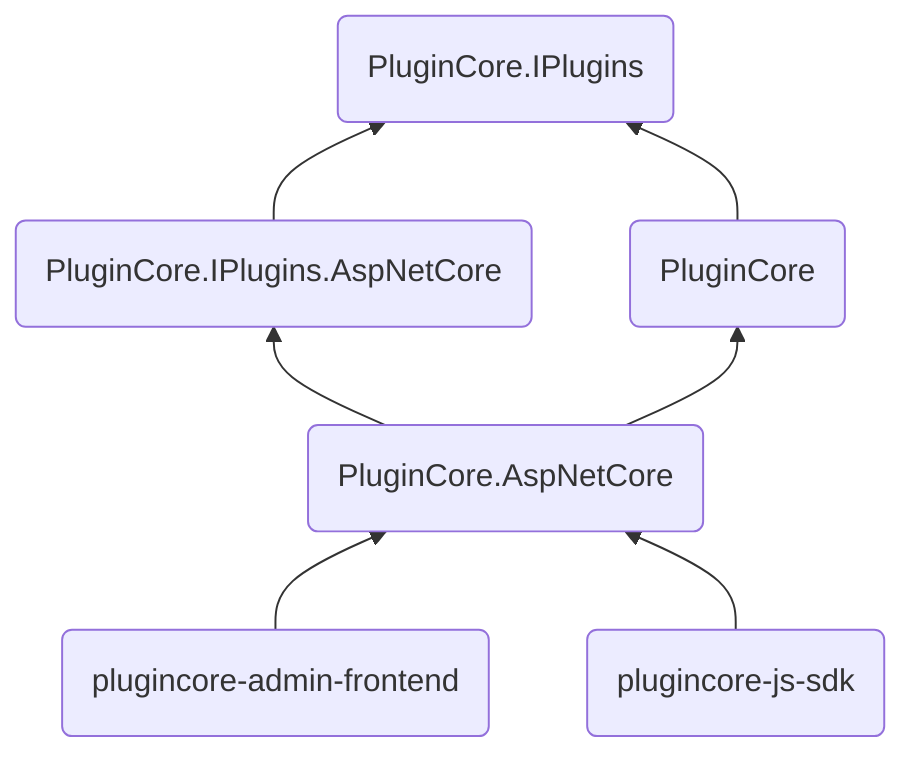

<p align="center">
  
</p>
<h1 align="center">PluginCore</h1>

[English](README.md) | 中文

> 适用于 ASP.NET Core 的轻量级插件框架

[]()
[](https://github.com/yiyungent/PluginCore/blob/main/LICENSE)
[](https://www.codefactor.io/repository/github/yiyungent/plugincore)
[](https://www.nuget.org/packages/PluginCore/)
[](https://jq.qq.com/?_wv=1027&k=q5R82fYN)
[](https://t.me/xx_dev_group)
<!--  -->
[](https://cla-assistant.io/yiyungent/PluginCore)


## 介绍

适用于 ASP.NET Core 的轻量级插件框架

- **简单** - 约定优于配置, 以最少的配置帮助你专注于业务
- **开箱即用** - 前后端自动集成, 两行代码完成集成
- **动态 WebAPI** - 每个插件都可新增 Controller, 拥有自己的路由
- **插件前后端分离** - 可在插件 `wwwroot` 文件夹下放置前端文件 (index.html,...), 然后访问 `/plugins/pluginId/index.html`
- **热插拔** - 上传、安装、启用、禁用、卸载、删除 均无需重启站点; 甚至可通过插件在运行时添加 `HTTP request pipeline middleware`, 也无需重启站点
- **依赖注入** - 可在 实现 `IPlugin` 的插件类的构造方法上申请依赖注入项, 当然 `Controller` 构造方法上也可依赖注入
- **模块化** - 过程模块化, 全程依赖注入, 可通过替换实现以便自定义插件机制
- **易扩展** - 你可以编写你自己的插件sdk, 然后引用插件sdk, 编写扩展插件 - 自定义插件钩子, 并应用
- **挂件** - 你可在前端埋扩展点, 然后通过插件插入挂件
- **无需数据库** - 无数据库依赖
- **0侵入** - 近乎0侵入, 不影响你的现有系统
- **极少依赖** - 只依赖于一个第三方包 ( 用于解压的 `SharpZipLib` )


## 在线演示

- http://plugincore.moeci.com/PluginCore/Admin
  - 用户名: admin  密码: ABC12345
  - 在线演示, 功能大部分受限, 完整体验, 请自行搭建, 可使用下方 Docker 快速体验
  - 非最新版本


## 截图


## 一分钟集成

推荐使用 [NuGet](https://www.nuget.org/packages/PluginCore), 在你项目的根目录 执行下方的命令, 如果你使用 Visual Studio, 这时依次点击 **Tools** -> **NuGet Package Manager** -> **Package Manager Console** , 确保 "Default project" 是你想要安装的项目, 输入下方的命令进行安装.

### 在你的 ASP.NET Core 项目中集成

```bash
PM> Install-Package PluginCore.AspNetCore
```

> 在你的 ASP.NET Core 应用程序中修改代码
>
> Startup.cs

```C#
using PluginCore.AspNetCore.Extensions;

// This method gets called by the runtime. Use this method to add services to the container.
public void ConfigureServices(IServiceCollection services)
{
    services.AddControllers();

    // 1. 添加 PluginCore
    services.AddPluginCore();
}

// This method gets called by the runtime. Use this method to configure the HTTP request pipeline.
public void Configure(IApplicationBuilder app, IWebHostEnvironment env)
{
    if (env.IsDevelopment())
    {
        app.UseDeveloperExceptionPage();
    }

    app.UseHttpsRedirection();

    app.UseRouting();

    // 2. 使用 PluginCore
    app.UsePluginCore();

    app.UseAuthorization();

    app.UseEndpoints(endpoints =>
    {
        endpoints.MapControllers();
    });
}
```

> 现在访问 https://localhost:5001/PluginCore/Admin 即可进入 PluginCore Admin  
> https://localhost:5001 需改为你的地址

### 注意

请登录 `PluginCore Admin` 后，为了安全，及时修改默认用户名，密码:

`App_Data/PluginCore.Config.json`     

```json
{
	"Admin": {
		"UserName": "admin",
		"Password": "ABC12345"
	},
	"FrontendMode": "LocalEmbedded",
	"RemoteFrontend": "https://cdn.jsdelivr.net/gh/yiyungent/plugincore-admin-frontend@0.1.2/dist-cdn"
}
```

修改后，立即生效，无需重启站点，需重新登录 `PluginCore Admin`


## Docker 体验

如果你需要在本地体验 PluginCore, 那么这里有一个 [例子(/examples)](https://github.com/yiyungent/PluginCore/tree/main/examples)

```bash
docker run -d -p 5004:80 -e ASPNETCORE_URLS="http://*:80" --name plugincore-aspnetcore3-1 yiyungent/plugincore-aspnetcore3-1
```

现在你可以访问 http://localhost:5004/PluginCore/Admin

> 补充:     
> 若使用 `Docker Compose`, 可参考仓库根目录下的 `docker-compose.yml`     

> 补充:   
> 使用 `ghcr.io`     
> 
> ```bash
> docker run -d -p 5004:80 -e ASPNETCORE_URLS="http://*:80" --name plugincore-aspnetcore3-1 ghcr.io/yiyungent/plugincore-aspnetcore3-1
> ```

## 使用

- [详细文档(/docs)](https://moeci.com/PluginCore "在线文档") 文档构建中
- [见示例(/examples)](https://github.com/yiyungent/PluginCore/tree/main/examples)


### 添加插件钩子, 并应用

> 1.例如，自定义插件钩子: `ITestPlugin`

```C#
using PluginCore.IPlugins;

namespace PluginCore.IPlugins
{
    public interface ITestPlugin : IPlugin
    {
        string Say();
    }
}
```

> 2.在需要激活的地方，应用钩子，这样所有启用的插件中，实现了 `ITestPlugin` 的插件，都将调用 `Say()`

```C#
using PluginCore;
using PluginCore.IPlugins;

namespace WebApi.Controllers
{
    [Route("api/[controller]")]
    [ApiController]
    public class TestController : ControllerBase
    {
        private readonly PluginFinder _pluginFinder;

        public TestController(PluginFinder pluginFinder)
        {
            _pluginFinder = pluginFinder;
        }

        public ActionResult Get()
        {
            //var plugins = PluginFinder.EnablePlugins<BasePlugin>().ToList();
            // 所有实现了 ITestPlugin 的已启用插件
            var plugins2 = _pluginFinder.EnablePlugins<ITestPlugin>().ToList();

            foreach (var item in plugins2)
            {
                // 调用
                string words = item.Say();
                Console.WriteLine(words);
            }

            return Ok("");
        }
    }
}
```

### 自定义前端

PluginCore 支持3种前端文件加载方式

> 配置文件 `App_Data/PluginCore.Config.json` 中 `FrontendMode`

1. LocalEmbedded
  - 默认, 嵌入式资源，前端文件打包进dll, 此模式下, 不容易自定义前端文件，需要修改 `PluginCore` 源代码，重新编译，不建议

2. LocalFolder
  - 在集成了 `PluginCore` 的 ASP.NET Core 项目中, 新建 `PluginCoreAdmin`, 将前端文件放入此文件夹

3. RemoteCDN
  - 使用远程cdn资源, 可通过 配置文件中 `RemoteFrontend` 指定url

> **注意:**    
> 更新 `FrontendMode`, 需重启站点后, 才能生效


### 补充

> **补充**
>
> 开发插件只需要, 添加对 `PluginCore.IPlugins` 包 (插件sdk) 的引用即可，        
>
> 当然如果你需要 `PluginCore` ,  也可以添加引用


> **规范**
>
> 1. 插件sdk
>
> 插件接口应当位于 `PluginCore.IPlugins` 命名空间，这是规范，不强求，但建议这么做，      
>
> 程序集名不一定要与命名空间名相同，你完全在你的插件sdk程序集中，使用 `PluginCore.IPlugins` 命名空间。
>
> 2. 插件
>
> 插件程序集名(一般=项目(Project)名) 与 插件 `info.json` 中 `PluginId` 一致, 例如: Project: `HelloWorldPlugin`, PluginId: `HelloWorldPlugin`,  此项必须，否则插件无法加载
> `PluginId` 为插件唯一标识


## 版本依赖

> 自 `PluginCore.IPlugins-v0.8.0` 起, `PluginCore` 项目重构, `PluginCore` 只包含核心插件逻辑, `ASP.NET Core` 需要使用 `PluginCore.AspNetCore`

|      PluginCore.IPlugins       |     0.8.0     |     0.8.0     |     0.8.0     |     0.8.0     |     0.8.0     |     0.8.0     |     0.8.0     |     0.8.0     |     0.8.0     |     0.8.0     |     0.8.0     |     0.8.0     |
| :----------------------------: | :-----------: | :-----------: | :-----------: | :-----------: | :-----------: | :-----------: | :-----------: | :-----------: | :-----------: | :-----------: | :-----------: | :-----------: |
|           PluginCore           |     1.0.0     |     1.0.0     |     1.0.0     |     1.0.0     |     2.0.0     |     2.0.0     |     2.0.1     |     2.0.1     |     2.0.1     |     2.0.2     |     2.0.2     |     2.1.0     |
| PluginCore.IPlugins.AspNetCore |     0.0.1     |     0.0.1     |     0.0.1     |     0.0.1     |     0.0.1     |     0.0.1     |     0.0.1     |     0.0.1     |     0.0.1     |     0.0.1     |     0.0.1     |     0.0.1     |
|     PluginCore.AspNetCore      |     0.0.2     |     0.0.3     |     0.0.4     |     0.0.5     |     0.0.5     |     1.0.0     |     1.0.1     |     1.0.2     |     1.0.3     |     1.0.4     |     1.1.0     |     1.2.0     |
|   plugincore-admin-frontend    | 0.1.0 - 0.3.1 | 0.1.0 - 0.3.1 | 0.1.0 - 0.3.1 | 0.1.0 - 0.3.1 | 0.1.0 - 0.3.1 | 0.1.0 - 0.3.1 | 0.1.0 - 0.3.1 |     0.3.2     |     0.3.2     |     0.3.2     |     0.3.2     |     0.3.2     |
|       plugincore-js-sdk        | 0.1.0 - 0.5.0 | 0.1.0 - 0.5.0 | 0.1.0 - 0.5.0 | 0.1.0 - 0.5.0 | 0.1.0 - 0.5.0 | 0.1.0 - 0.5.0 | 0.1.0 - 0.5.0 | 0.1.0 - 0.5.0 | 0.1.0 - 0.5.0 | 0.1.0 - 0.5.0 | 0.1.0 - 0.5.0 | 0.1.0 - 0.5.0 |

> 下方为旧版依赖, 仅作存档

|    PluginCore.IPlugins    | 0.1.0 | 0.1.0 | 0.2.0 | 0.2.0 | 0.2.0 | 0.3.0 | 0.3.0 | 0.4.0 | 0.5.0 | 0.6.0 | 0.6.0 | 0.6.0 | 0.6.0 | 0.6.1 | 0.6.1 | 0.6.1 | 0.7.0 | 0.7.0 | 0.7.0 | 0.7.0 |
| :-----------------------: | :---: | :---: | :---: | :---: | :---: | :---: | :---: | :---: | :---: | :---: | :---: | :---: | :---: | :---: | :---: | :---: | :---: | :---: | :---: | :---: |
|        PluginCore         | 0.1.0 | 0.2.0 | 0.3.0 | 0.3.1 | 0.4.0 | 0.5.0 | 0.5.1 | 0.6.0 | 0.7.0 | 0.8.0 | 0.8.1 | 0.8.2 | 0.8.3 | 0.8.4 | 0.8.5 | 0.8.6 | 0.9.0 | 0.9.1 | 0.9.2 | 0.9.3 |
| plugincore-admin-frontend | 0.1.0 | 0.1.2 | 0.1.2 | 0.1.3 | 0.1.3 | 0.2.0 | 0.2.0 | 0.2.0 | 0.2.0 | 0.2.0 | 0.2.3 | 0.2.3 | 0.2.3 | 0.2.3 | 0.3.0 | 0.3.0 | 0.3.0 | 0.3.0 | 0.3.0 | 0.3.1 |
|     plugincore-js-sdk     |   -   |   -   |   -   |   -   |   -   |   -   |   -   |   -   |   -   |   -   |   -   |   -   |   -   |   -   |   -   |   -   | 0.1.0 | 0.1.0 | 0.1.0 | 0.1.0 |


|      PluginCore.IPlugins       | [](https://www.nuget.org/packages/PluginCore.IPlugins/) | [](https://www.nuget.org/packages/PluginCore.IPlugins/) |
| :----------------------------: | :----------------------------------------------------------: | :----------------------------------------------------------: |
|           PluginCore           | [](https://www.nuget.org/packages/PluginCore/) | [](https://www.nuget.org/packages/PluginCore/) |
| PluginCore.IPlugins.AspNetCore | [](https://www.nuget.org/packages/PluginCore.IPlugins.AspNetCore/) | [](https://www.nuget.org/packages/PluginCore.IPlugins.AspNetCore/) |
|     PluginCore.AspNetCore      | [](https://www.nuget.org/packages/PluginCore.AspNetCore/) | [](https://www.nuget.org/packages/PluginCore.AspNetCore/) |
|      PluginCore.Template       | [](https://www.nuget.org/packages/PluginCore.Template/) | [](https://www.nuget.org/packages/PluginCore.Template/) |
|      plugincore-admin-frontend       | [](https://www.npmjs.com/package/plugincore-admin-frontend) | [](https://www.npmjs.com/package/plugincore-admin-frontend) |
|      plugincore-js-sdk       | [](https://www.npmjs.com/package/@yiyungent/plugincore) | [](https://www.npmjs.com/package/@yiyungent/plugincore) |


## Project structure



## 环境

- 运行环境: .NET Core 3.1 (+)
- 开发环境: Visual Studio Community 2019

## 相关项目

### 本项目组件

- [yiyungent/plugincore-admin-frontend](https://github.com/yiyungent/plugincore-admin-frontend) - PluginCore Admin 前端实现
- [yiyungent/plugincore-js-sdk](https://github.com/yiyungent/plugincore-js-sdk) - 前端挂件 依赖

### 本项目前生/相关

- [yiyungent/Remember.Core](https://github.com/yiyungent/Remember.Core) - 🐬 .NET Web 应用框架。remember for ASP.NET Core
- [yiyungent/PluginHub](http://github.com/yiyungent/PluginHub) - 🍰 ASP.NET MVC 插件化解决方案
- [yiyungent/Templates](https://github.com/yiyungent/Templates) - 🎨 ASP.NET MVC5 多主题模板解决方案

### 使用本项目的项目

- [yiyungent/KnifeHub](https://github.com/yiyungent/KnifeHub) - 【PluginCore.AspNetCore 最佳实践】工具平台 | 日常生活/学习/工作/开发 工具集
- [yiyungent/Dragonfly](https://github.com/yiyungent/Dragonfly) - ASP.NET Core + Selenium 实现 Web 自动化

## 赞助者

TODO: 

## 鸣谢

- 插件系统设计参考自 <a href="https://github.com/lamondlu/CoolCat" target="_blank">CoolCat</a>，感谢作者 lamondlu 的贡献
- 设计参考自 <a href="https://github.com/nopSolutions/nopCommerce" target="_blank">nopCommerce</a>，感谢作者 nopSolutions 的贡献

## Donate

PluginCore is an Apache-2.0 licensed open source project and completely free to use. However, the amount of effort needed to maintain and develop new features for the project is not sustainable without proper financial backing.

We accept donations through these channels:

- <a href="https://afdian.net/@yiyun" target="_blank">爱发电</a> (￥5.00 起)
- <a href="https://dun.mianbaoduo.com/@yiyun" target="_blank">面包多</a> (￥1.00 起)

## Author

**PluginCore** © [yiyun](https://github.com/yiyungent), Released under the [Apache-2.0](./LICENSE) License.<br>
Authored and maintained by yiyun with help from contributors ([list](https://github.com/yiyungent/PluginCore/contributors)).

> GitHub [@yiyungent](https://github.com/yiyungent) Gitee [@yiyungent](https://gitee.com/yiyungent)

<!-- Matomo Image Tracker-->

<!-- End Matomo -->
