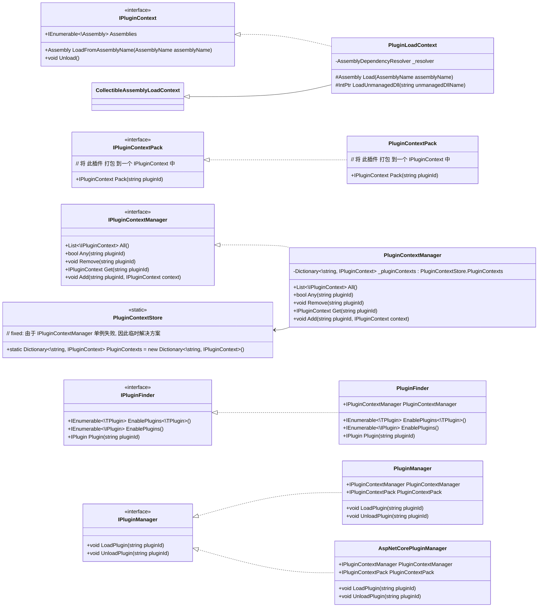

# 系统设计

```mermaid
classDiagram
direction LR

class IPluginContext {
    <<interface>>
    +IEnumerable<\Assembly> Assemblies 

    +Assembly LoadFromAssemblyName(AssemblyName assemblyName)
    +void Unload()
}

class IPluginContextPack {
    <<interface>>
    // 将 此插件 打包 到一个 IPluginContext 中
    +IPluginContext Pack(string pluginId)
}

class IPluginContextManager {
    <<interface>>
    +List<\IPluginContext> All()
    +bool Any(string pluginId)
    +void Remove(string pluginId)
    +IPluginContext Get(string pluginId)
    +void Add(string pluginId, IPluginContext context)
}

class IPluginFinder {
    <<interface>>
    +IEnumerable<\TPlugin> EnablePlugins<\TPlugin>()
    +IEnumerable<\IPlugin> EnablePlugins()
    +IPlugin Plugin(string pluginId)
}

class IPluginManager {
    <<interface>>
    +void LoadPlugin(string pluginId)
    +void UnloadPlugin(string pluginId)
}

IPluginContext <|.. PluginLoadContext
CollectibleAssemblyLoadContext <|-- PluginLoadContext
class PluginLoadContext {
    -AssemblyDependencyResolver _resolver

    #Assembly Load(AssemblyName assemblyName)
    #IntPtr LoadUnmanagedDll(string unmanagedDllName)
}

IPluginContextPack <|.. PluginContextPack
class PluginContextPack {
    // 将 此插件 打包 到一个 IPluginContext 中
    +IPluginContext Pack(string pluginId)
}

IPluginContextManager <|.. PluginContextManager
PluginContextStore <-- PluginContextManager
class PluginContextManager {
    -Dictionary<\string, IPluginContext> _pluginContexts : PluginContextStore.PluginContexts

    +List<\IPluginContext> All()
    +bool Any(string pluginId)
    +void Remove(string pluginId)
    +IPluginContext Get(string pluginId)
    +void Add(string pluginId, IPluginContext context)
}

class PluginContextStore {
    <<static>>
    // fixed: 由于 IPluginContextManager 单例失败, 因此临时解决方案
    +static Dictionary<\string, IPluginContext> PluginContexts = new Dictionary<\string, IPluginContext>()
}

IPluginFinder <|.. PluginFinder
class PluginFinder {
    +IPluginContextManager PluginContextManager

    +IEnumerable<\TPlugin> EnablePlugins<\TPlugin>()
    +IEnumerable<\IPlugin> EnablePlugins()
    +IPlugin Plugin(string pluginId)
}

IPluginManager <|.. PluginManager
class PluginManager {
    +IPluginContextManager PluginContextManager
    +IPluginContextPack PluginContextPack
    
    +void LoadPlugin(string pluginId)
    +void UnloadPlugin(string pluginId)
}

IPluginManager <|.. AspNetCorePluginManager
class AspNetCorePluginManager {
    +IPluginContextManager PluginContextManager
    +IPluginContextPack PluginContextPack

    +void LoadPlugin(string pluginId)
    +void UnloadPlugin(string pluginId)
}

```
